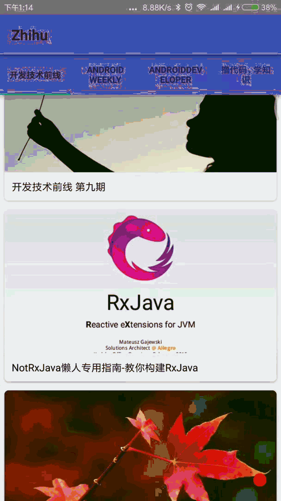

## 简介
一个可以查看知乎专栏的Android应用( 未完全完成).

在UI上借鉴了[7449/ZLSimple](https://github.com/7449/ZLSimple)的样式

## 使用的第三方库

### 网络与异步操作库
1. Retrofit2
2. RxJava
3. OkHttp

### 图片加载库
1. Glide

### 布局与空间
1. CardView

## 截图

